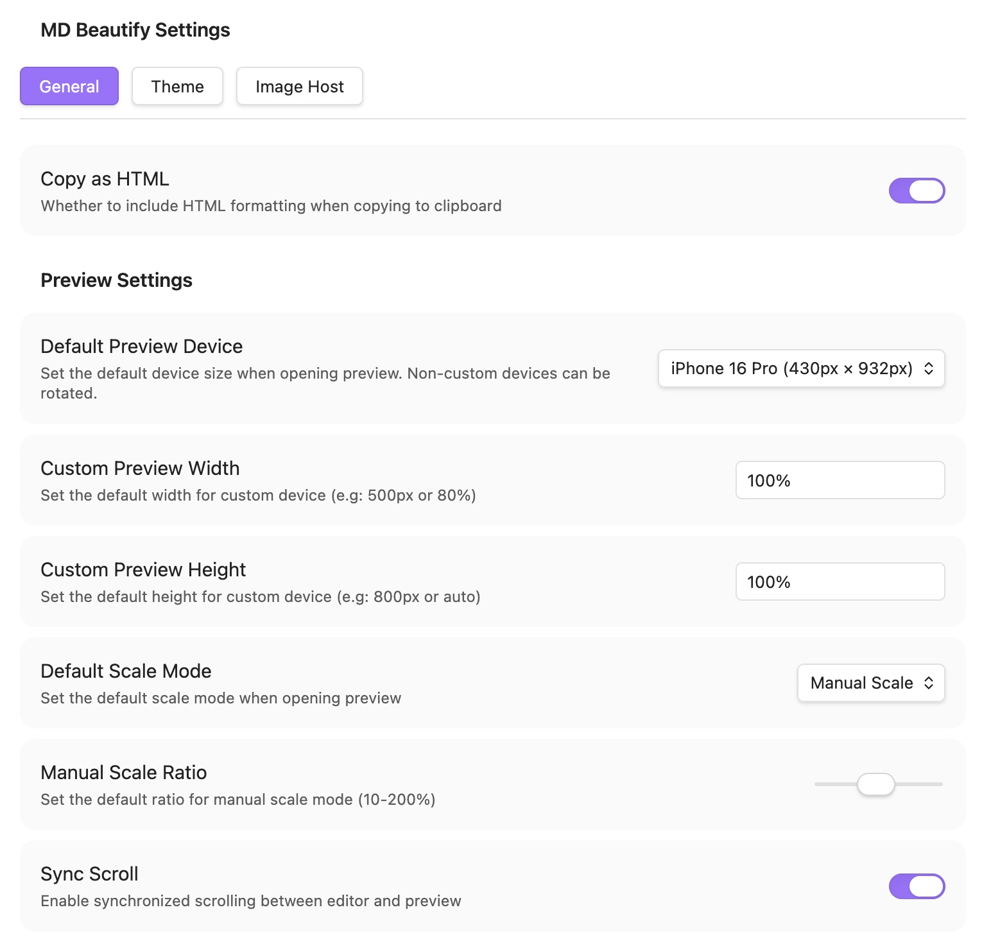
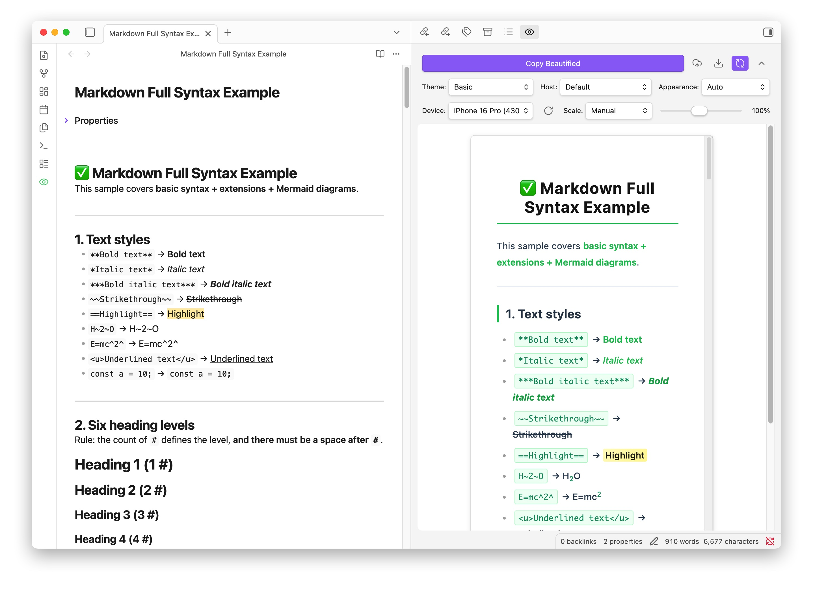
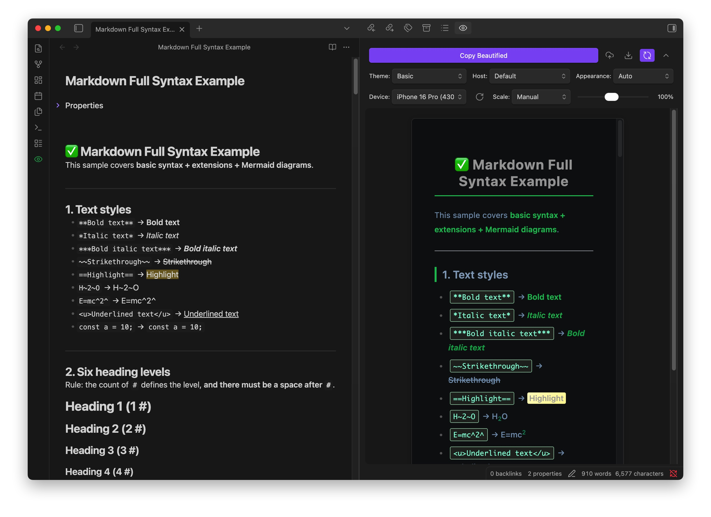

# MD Beautify for Obsidian

**MD Beautify** is an elegant Markdown beautification plugin for Obsidian. It is the Obsidian integration of [MD Beautify](https://github.com/qingu-x/md-beautify), helping you format and style your notes perfectly for platforms like WeChat Official Accounts, and other rich-text editors.

[English](README.md) | [简体中文](README_zh.md)

---

### ✨ Key Features

- **🚀 One-click Beautification**: Transform your Markdown into beautiful rich text with professional themes instantly.
- **📱 WeChat Optimized**: Specifically designed to handle WeChat's unique CSS restrictions (e.g., auto-converting pseudo-elements).
- **🎨 Multiple Themes**: Built-in professional themes for different types of content (Academic, Minimalist, Cyberpunk, etc.).
- **👁️ Live Preview**: Real-time preview with synchronized scrolling and theme mode switching (light/dark).
- **📦 Export Options**: Export your notes as HTML or PDF.
- **📊 Mermaid Support**: Full support for Mermaid charts and diagrams with automatic theme adaptation.
- **☁️ Image Upload**: Batch upload local images to cloud storage (Qiniu, Aliyun, Tencent Cloud, S3, etc.).
- **⚙️ Customization**: Fine-tune quotes, headings, and colors with a built-in custom CSS editor.

### 📸 Screenshot

### 🖼️ Preview

| Light Mode                      | Dark Mode                     |
| ------------------------------- | ----------------------------- |
|  |  |

### 🚀 How to Use

1. **Open** any Markdown file in Obsidian.
2. **Launch**: Click the "MD Beautify" icon in the ribbon or use the command palette (`Ctrl/Cmd + P` -> `MD Beautify`).
3. **Customize**: Select a theme and adjust styles in the sidebar.
4. **Preview**: See real-time rendering with synchronized scrolling.
5. **Action**:
   - **Copy**: Click "Copy Beautified" to paste into WeChat or other platforms.
   - **Export**: Save as HTML or PDF.
   - **Upload**: Batch upload local images to your configured cloud storage.

### 🛠️ Advanced Features

#### Theme & UI

- Custom CSS editor with live preview.
- Light/Dark mode auto-follow system preference.
- Mobile-view simulation (fixed-width preview).

#### Image Management

- Auto-upload on paste/drag-and-drop.
- Support for multiple cloud storage providers.
- Batch upload all local images in the current file.

#### Export & Share

- **HTML Export**: Standalone file with embedded styles.
- **PDF Export**:
  - Image mode: Non-selectable, perfect for WeChat.
  - Vector mode: Selectable text, better for printing.
- **Mermaid Support**: Automatic rendering and theme adaptation.

### 📥 Installation

- **From Community Plugins**: Search for `MD Beautify` in Obsidian's Community Plugins (Coming soon).
- **Manual**: Download `main.js`, `manifest.json`, and `styles.css` from the [latest release](https://github.com/qingu-x/obsidian-md-beautify-plugin/releases), and place them in your vault's `.obsidian/plugins/md-beautify/` folder.

---

### 💬 Support & Feedback

If you enjoy this plugin, please consider giving it a ⭐ on [GitHub](https://github.com/qingu-x/obsidian-md-beautify-plugin)!

For bugs and feature requests, please [open an issue](https://github.com/qingu-x/obsidian-md-beautify-plugin/issues).

---

License: [MIT](LICENSE)
